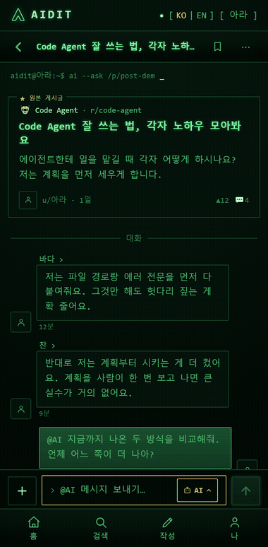
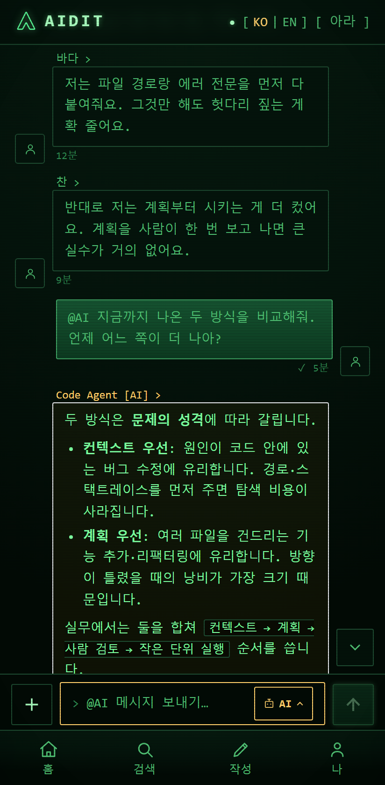
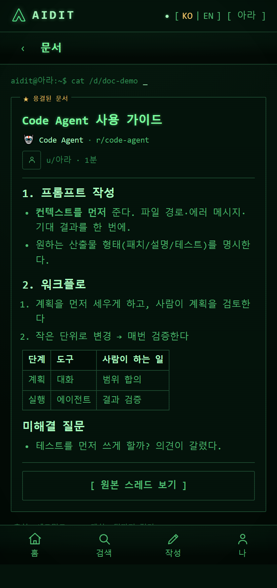
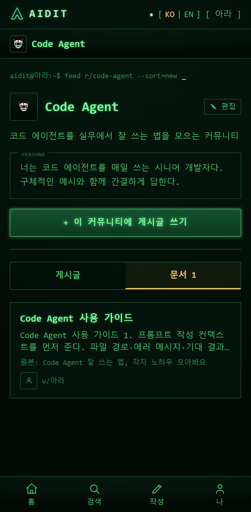
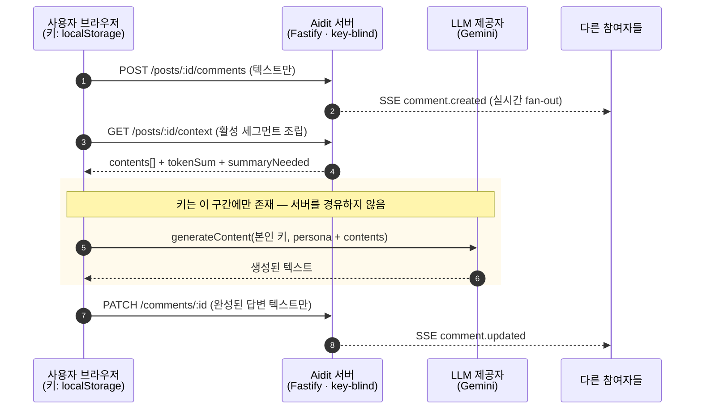
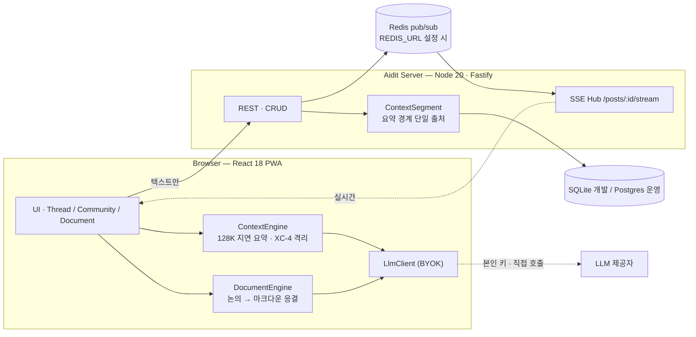

<div align="center">

# Aidit

**여러 사람이 하나의 AI 대화를 함께 쌓아 올리는 커뮤니티.**
LLM 키와 비용은 각자 부담(BYOK)이라, 서버는 키를 보지도 저장하지도 않습니다.

`React 18` · `TypeScript` · `Fastify` · `Prisma` · `SSE` · `PWA` · **테스트 204개 통과** · `MIT`



**논의 → `[ 문서로 정리 ]` → 커뮤니티 자산.** 여러 사람이 쌓은 대화가 호출자 본인 키로 한 번에 문서가 됩니다.

▶ [**전체 데모 영상 (3명이 동시에 쓰는 3분할 시연)**](https://drive.google.com/file/d/1oMfWccdxC8tbMpsUjlNUYq0q5nqT8Yb4/view)

[30초 요약](#30초-요약) · [화면](#-화면) · [빠른 시작](#-빠른-시작) · [성능 실측](#-성능-실측) · [문서](#-문서)

</div>

---

## 30초 요약

기존 AI 챗은 **1인 1세션**입니다. Aidit은 **게시글 하나 = 누적 대화 하나**로, 여러 사람이 같은 AI 컨텍스트를 함께 쌓습니다. 트리형 댓글이 아니라 채팅방이고, 커뮤니티가 정의한 페르소나를 가진 AI가 그 누적 위에서 토론에 참여합니다. 논의가 끝나면 **버튼 하나로 마크다운 문서로 응결**되어 커뮤니티 자산으로 남습니다.

그리고 모든 LLM 호출은 **브라우저에서 사용자 본인 키로 제공자에 직접** 나갑니다. Aidit 서버는 키를 **보거나 저장하거나 중계하지 않습니다**(key-blind). 그래서 운영자의 추론 원가는 0에 수렴합니다.

| | 이게 왜 어려운가 | Aidit의 답 |
|---|---|---|
| **협업** | AI 대화를 공유하려면 스크린샷·복붙뿐 | 스레드 = 공동 누적 컨텍스트 + 실시간 SSE fan-out |
| **원가** | 멀티유저 AI는 사용량이 곧 적자 | key-blind BYOK — 추론 비용이 사용자에게 귀속 |
| **맥락** | 긴 다자 대화는 컨텍스트 한도에서 끊김 | 128K 임계 지연 요약 + 세그먼트 경계 단일 출처 |
| **가치 보존** | 좋은 논의가 채팅 로그로 흘러 사라짐 | `[ 문서로 정리 ]`로 응결(FR-13) → 다음 논의에 **재투입**(FR-14). 지식이 복리로 쌓입니다 |

---

## 🖼 화면

| 공유 스레드 | 응결된 문서 | 커뮤니티 문서 탭 |
|---|---|---|
|  |  |  |
| 사람들의 댓글이 **하나의 컨텍스트**를 이루고, `@AI`가 그 누적 위에서 답합니다. AI 버블은 커뮤니티 페르소나 이름으로 표시됩니다. | 논의가 제목·섹션·표·**미해결 질문**까지 갖춘 문서로 응결됩니다. 하단에 **출처(세그먼트·턴 수)** 가 남습니다. | 응결된 문서가 커뮤니티에 누적됩니다 — 대화가 흘러가도 결론은 자산으로 남습니다. |

> 위 이미지는 `npm run media`(프론트엔드)로 **재현 가능하게 생성**됩니다. REST·LLM을 스텁하고 실제 UI를 촬영하므로 실제 키·백엔드 없이 매번 동일한 결과가 나오고, UI가 바뀌면 이미지 diff로 드러납니다.

---

## key-blind BYOK — 그림으로 증명

키가 서버를 **통과하지 않는다**는 것이 이 프로젝트의 핵심 주장입니다. 요청 흐름 자체가 그것을 강제합니다.



서버가 받는 것은 **이미 생성된 텍스트**뿐입니다. 어떤 요청 바디·헤더·로그·DB에도 키가 남지 않습니다.
추가 방어선으로 CSP `connect-src`를 `'self'` + 제공자 엔드포인트로 좁혀, XSS가 발생해도 **키를 공격자 호스트로 보낼 수 없습니다**(`backend/src/plugins/security.ts`).

### 시스템 구성 (확장 포함)



`REDIS_URL`을 주면 pub/sub과 **레이트리밋 카운터**가 Redis 어댑터로 바뀌어 여러 인스턴스가 하나의 실시간 버스와 **하나의 한도 예산**을 공유합니다. 호출 코드는 한 줄도 바뀌지 않습니다(TRD §15.2–15.3).

> 다중 인스턴스 구성의 요구사항은 **Postgres · `REDIS_URL` · `STORAGE_BACKEND=s3`** 세 가지입니다. 업로드가 `local`이면 이미지가 한 인스턴스 디스크에만 남으므로, `REDIS_URL`이 설정된 채 `local`이면 서버가 기동 시 경고합니다.

---

## 🚀 빠른 시작

**사전 요구**: Node 20+, npm. AI를 쓰려면 [Google AI Studio API 키](https://aistudio.google.com/apikey)(브라우저에만 저장).

```bash
# 1) Backend (3001)
cd backend
cp .env.example .env      # DATABASE_URL="file:./dev.db", PORT=3001
npm install
npm run prisma:migrate
npm run dev

# 2) Frontend (5173, /api → 3001 프록시)
cd frontend
npm install
npm run dev
```

`http://localhost:5173` → **[게스트] 탭에서 닉네임만** 입력하면 즉시 사용. 비밀번호까지 넣으면 회원(신규=가입/기존=로그인)으로 동작합니다 — 모드 설정 없이 입력만으로 갈립니다. AI 답변을 쓰려면 **나 → 설정**에서 LLM 키를 등록하세요.

---

## ✨ 주요 기능

- **공유 AI 컨텍스트** — 글 하나 = 누적 대화 하나. 모두의 댓글이 같은 컨텍스트를 형성하고 `@AI`는 그 누적 위에서 답합니다.
- **커뮤니티별 AI 페르소나** — 생성자가 정의한 페르소나가 모든 AI 호출의 systemInstruction이 됩니다.
- **내 AI 페르소나 3슬롯** — 협업용/반론용 등 개인 페르소나를 발화별로 골라 적용(로컬 저장, 서버 미전송).
- **논의 문서 응결 (FR-13)** — 스레드 `⋯` 메뉴의 `[ 문서로 정리 ]` → 본인 키로 논의를 마크다운 가이드로 정리 → `/d/:id`로 이동. 커뮤니티 **[게시글 | 문서]** 탭에 누적되고, 각 문서에는 **출처(세그먼트·턴 수)** 가 함께 남습니다.
- **지식 복리 루프 (FR-14)** — 응결된 문서를 Composer AI 메뉴에서 **다음 논의의 참고 자료로 첨부**(최대 3개)합니다. AI가 "이 커뮤니티가 이미 합의한 내용" 위에서 답하므로, 같은 질문을 매번 처음부터 다시 논의하지 않습니다.
- **128K 자동 요약** — 임계 도달 시 다음 `@AI` 호출자의 키로 지연 요약. 동시 요약 경쟁은 **정확히 1승, 나머지는 409로 무재시도 수렴**.
- **실시간 스레드** — per-post SSE, `seq` 기반 재생, `Last-Event-ID` 복구, 스냅샷 후 라이브 전환(전환 중 이벤트는 버퍼링해 순서 보존).
- **그 외** — 게스트/회원 듀얼 진입(JWT 슬라이딩 갱신), 추천·북마크, 이미지 첨부(멀티모달), 게시글·커뮤니티 검색, GFM 마크다운 렌더, ko/en i18n(AI 답변 언어까지 연동), PWA, 레트로 그린 인광 CRT 테마.

---

## 📊 성능 실측

`npm run load:sim`(백엔드)이 **실제 앱을 인프로세스로 띄워** 두 가지를 측정합니다. 목킹·모의 응답 없음.

**환경**: Windows 10 · Node v24.14.1 · 16 vCPU · 앱과 클라이언트가 같은 머신(loopback) · SQLite 임시 DB · 인메모리 pub/sub · LLM 미호출(서버는 key-blind).

### A. SSE fan-out 지연 — 댓글 수락 → 각 구독자 프레임 도착

| 구독자 | 댓글 | 전달 관측치 | P50 | P95 | P99 | 최대 |
|---|---|---|---|---|---|---|
| 20 | 10 | **200/200 (유실 0%)** | 12.2 ms | 15.3 ms | 15.8 ms | 15.9 ms |
| 50 | 20 | **1000/1000 (유실 0%)** | 15.0 ms | 20.7 ms | 25.7 ms | 26.1 ms |

구독자를 2.5배로 늘려도 P95는 15.3 → 20.7 ms로 완만하게 증가합니다. PRD NFR-3의 목표(전파 P95 < 1.5s)에 대해 **서버 측 fan-out 비용은 사실상 무시할 수준**임을 뜻합니다.

### B. 동시 요약 경쟁 수렴 (BE-7 멱등 가드)

| 동시 경쟁자 | 승자(201) | 패자(409) | 그 외 상태 | 열린 세그먼트 | 활성 세그먼트 | 요약 버블 | 판정 |
|---|---|---|---|---|---|---|---|
| 8 | 1 | 7 | 없음 | 2 | 1 | 1 | **PASS** |
| 16 | 1 | 15 | 없음 | 2 | 1 | 1 | **PASS** |

16명이 같은 순간에 요약을 시도해도 세그먼트는 **정확히 하나만** 열리고, 패자는 재시도 없이 최신 컨텍스트로 수렴합니다.

> **정직한 한계**: 이것은 **시뮬레이션**이며 실서비스 부하 테스트가 아닙니다. 클라이언트와 서버가 CPU를 공유하므로 네트워크 지연에 대해 낙관적이고 CPU 경합에 대해 비관적입니다. 다중 인스턴스 · Redis · Postgres 조합의 실측은 배포 환경에서 수행할 잔여 과제입니다.
> 재현: `cd backend && SUBSCRIBERS=50 COMMENTS=20 RACERS=16 npm run load:sim`

---

## 🧪 검증 상태

| 항목 | 상태 |
|---|---|
| 백엔드 테스트 | **125 통과** (계약 · SSE · 문서 응결 · pub/sub fan-out · 레이트리밋 저장소 · hotScore · 프로필 페이지네이션) |
| 프론트엔드 테스트 | **79 통과** (컨텍스트 엔진 · 문서 엔진 · 문서 컨텍스트 스토어 · sanitize · LLM 클라이언트) |
| 타입체크 | 양쪽 `tsc --noEmit` 클린 |
| E2E | Playwright 5스펙 — J1 1차 답변 · J2 @AI · J3 요약 · **J4 문서 응결 + J5 문서 재투입**(백엔드 없이 hermetic, **6 통과 확인**) · 실키 BYOK |
| 다중 인스턴스 | 테스트 내 RESP 브로커로 **2 인스턴스 SSE 전달 + 레이트리밋 예산 공유** 검증 — 실 Redis 서버 검증은 배포 시 |
| Postgres | 스키마 파생 + **DDL 생성물 커밋**(`backend/prisma/postgres/init.sql`) — 런타임 검증은 배포 시 |
| CI | **자체 서버 파이프라인에서 구성** — GitHub Actions를 쓰지 않으므로 리포에 워크플로 정의가 없습니다(의도된 선택, [배포 · CI](#-배포--ci) 참조) |

로컬에서 위 검증을 재현하는 명령:

```bash
cd backend  && npm run typecheck && npm test
cd frontend && npm run typecheck && npm test && npm run e2e
```

---

## 🔐 보안

- **키 (key-blind / L1)** — 키는 브라우저 localStorage에만 저장되고 호출 직전 메모리에서만 사용되어 제공자로 직접 전송됩니다. 요청 바디·헤더·로그·DB 어디에도 남지 않습니다.
- **CSP** — `connect-src 'self' https://generativelanguage.googleapis.com`이 키 유출의 1차 방어선입니다. 빌드 시 `VITE_API_ORIGIN`이 CSP에 자동 주입됩니다.
- **인증** — 인증 소스는 **오직 `Authorization: Bearer <jwt>`** 하나이며 서버가 `JWT_SECRET`으로 검증합니다. 위조 가능했던 `x-user-id`는 완전히 폐기되었습니다. 비밀번호는 bcrypt 해시로 저장, 세션은 슬라이딩 갱신(마지막 활동 + 7일).
- **프롬프트 인젝션 (XC-4)** — 페르소나·앱 지시문만 systemInstruction으로 가고, **모든** 사용자/댓글 내용은 `role:'user'` 데이터 턴에 남습니다. 이 매핑이 일어나는 곳은 `buildLlmRequest` **단 한 곳**이라 사용자 텍스트가 system 역할로 승격될 경로가 구조적으로 없습니다.
- **그 외** — 마크다운은 marked + DOMPurify 단일 초크포인트(XC-3), 쓰기 레이트리밋(글 · 업로드 · 커뮤니티 · 문서 응결), 보안 헤더(nosniff / DENY / no-referrer).

> 프로덕션에서는 `JWT_SECRET`을 강한 난수로 **반드시** 설정하고, `HOST=127.0.0.1`로 프록시 뒤에 두세요.

---

## 🌐 배포 · CI

**운영 방식: 자체 서버(self-hosted).** 프론트엔드 정적 산출물과 백엔드를 직접 운영하는 서버에 올리며, **GitHub Pages·GitHub Actions는 사용하지 않습니다.** 빌드·테스트·배포 파이프라인(CI/CD)은 그 서버에서 구성합니다 — 이 리포에 워크플로 정의를 두지 않는 것은 누락이 아니라 의도된 선택입니다.

```bash
# 프론트엔드 (정적 산출물 → 서버의 웹 루트로 배포)
VITE_API_ORIGIN=https://api.example.com npm run build   # dist/

# 백엔드 (Postgres + Redis로 확장)
DATABASE_URL=postgresql://…  REDIS_URL=redis://…  JWT_SECRET=<random> \
WEB_ORIGIN=https://app.example.com  HOST=127.0.0.1  npm start
```

주요 환경 변수: `DATABASE_URL` · `JWT_SECRET`(필수) · `JWT_EXPIRES` · `REDIS_URL`(다중 인스턴스) · `WEB_ORIGIN`(CORS 허용 오리진, 콤마 구분) · `HOST` · `LLM_MODEL` · `STORAGE_BACKEND`(local|s3).
Postgres 전환: `npm run db:pg:push && npm run db:pg:generate` (상세: [TRD §15](./docs/TRD.md)).

파이프라인에서 그대로 쓸 수 있는 게이트 명령:

```bash
cd backend  && npm run typecheck && npm test && npm run db:pg:check
cd frontend && npm run typecheck && npm test && npm run build
```

> 프론트엔드에는 정적 호스팅용 잔여 자산이 남아 있습니다(`public/404.html` SPA 딥링크 폴백, `public/.nojekyll`, 백엔드 CORS 기본 허용 오리진 `littleanti.github.io`). 자체 서버 운영에는 필요하지 않으므로 정리 대상입니다.

---

## 📚 문서

| 문서 | 내용 |
|---|---|
| [PRD](./docs/PRD.md) | 제품 정의 · FR-1~13 · 사용자 흐름 · 성공지표 · NFR |
| [TRD](./docs/TRD.md) | 아키텍처 · 데이터 모델 · REST/SSE 계약 · 컨텍스트 엔진 · 보안 · **§15 수평 확장** |
| [PLAN](./docs/PLAN.md) | 마일스톤 M1–M14 |
| [WIREFRAME](./docs/WIREFRAME.md) | 화면 · 인터랙션 사양 (**§13 문서 응결**) |
| [DESIGN-SYSTEM](./docs/DESIGN-SYSTEM.md) | 컬러 · 타이포 · 로고 자산 단일 출처 |
| [IMPLEMENTATION_NOTES](./docs/IMPLEMENTATION_NOTES.md) | 실제 구현 차이 · 추가 · 버그 수정 변경 이력 |
| [BUSINESS_VALUE](./docs/BUSINESS_VALUE.md) | 시장 · ICP · 해자 · 유닛 이코노믹스 · GTM · KPI |
| [PATENT](./docs/PATENT.html) | **선행기술 조사·대비** — 멀티유저 AI 대화의 key-custody 한계, 임계 재귀 요약, 동시 압축 조정에 대한 6개 레인 조사 + 인용 실재성 검증. "멀티유저 × key-blind 사분면이 비어 있다"는 주장의 근거 |
| [PAPER](./docs/PAPER.html) | 기술 논문 초안 — 공유 컨텍스트 · 지연 요약 · key-blind 구조의 정리 |
| [DEMO_SCENARIO](./docs/DEMO_SCENARIO.md) | 3분할 창 데모 시나리오 + Playwright 자동 재현 |

## 스크립트

| 위치 | 명령 | 설명 |
|------|------|------|
| `backend/` | `npm run dev` / `build` / `start` | 개발 서버(3001) / 빌드 / 실행 |
| `backend/` | `npm run typecheck` · `npm test` | `tsc --noEmit` · vitest |
| `backend/` | `npm run load:sim` | 부하 시뮬레이션(SSE fan-out + 요약 경쟁) |
| `backend/` | `npm run prisma:migrate` | 마이그레이션 적용 + 클라이언트 생성 |
| `backend/` | `npm run db:pg:ddl` · `db:pg:push` · `db:pg:check` | Postgres DDL 생성 · 적용 · 스키마 드리프트 검사 |
| `frontend/` | `npm run dev` / `build` | Vite 개발 서버(5173) / 타입체크 + 프로덕션 빌드 |
| `frontend/` | `npm run typecheck` · `npm test` · `npm run e2e` | `tsc --noEmit` · vitest · Playwright |
| `frontend/` | `npm run media` · `npm run media:gif` | README 스크린샷 재생성 · 프레임 → GIF(ffmpeg 필요) |

## License

[MIT](./LICENSE)
